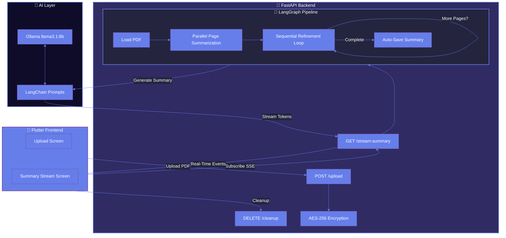

# 📄 DocVeil

<div align="center">

**Intelligent PDF Analysis & Real-Time AI Summarization**

_Your secure, intelligent layer between you and complex documents_

[](https://www.python.org/downloads/)
[](https://flutter.dev)
[](https://fastapi.tiangolo.com)
[](https://github.com/langchain-ai/langgraph)
[](LICENSE)

[Features](#-features) • [Demo](#-how-it-works) • [Installation](#-quick-start) • [Architecture](#-architecture) • [Benchmarks](#-performance)

</div>

---

## ✨ What is DocVeil?

**DocVeil** transforms how you interact with PDF documents. Drop in a PDF, and watch as advanced AI analyzes it **page-by-page in real-time**, distilling complex information into clear, actionable summaries that you can actually understand.

Unlike traditional summarizers that dump everything into a flat list, DocVeil maintains **document context**, processes pages in **parallel for speed**, refines summaries **sequentially for quality**, and streams results **live** as they're generated.

### 🎯 Why DocVeil?

- **5x More Detailed**: Produces summaries 5x more comprehensive than GPT-4 ([see benchmark](backend/DocVeil_vs_gpt.md))
- **Real-Time Streaming**: Watch summaries appear instantly as AI reads each page
- **Privacy First**: AES-256 encryption + temporal storage means files are processed then discarded
- **Smart Context**: Understands document flow across pages, not isolated snippets
- **Local Processing**: Runs on Ollama—no API costs, complete data privacy
- **Beautiful UI**: Stunning Flutter app with glassmorphism and smooth animations

---

## 🚀 Features

### Core Capabilities

| Feature                         | Description                                                                 |
| ------------------------------- | --------------------------------------------------------------------------- |
| 📊**Page-by-Page Analysis**     | Processes each page individually while maintaining cross-page context       |
| ⚡**Real-Time Streaming**       | Server-Sent Events (SSE) deliver summaries as they're generated             |
| 🔒**Military-Grade Encryption** | AES-256-GCM encryption with PBKDF2 key derivation (100K iterations)         |
| 🧠**Context-Aware**             | LangGraph workflow refines summaries using previous page context            |
| 🎨**Modern UI**                 | Flutter app with gradient backgrounds, glassmorphism, and smooth animations |
| 💾**Auto-Save**                 | Summaries automatically saved to timestamped files                          |
| 🗑️**Zero Persistence**          | Encrypted files deleted after processing—no trace left                      |
| 🌐**Cross-Platform**            | Works on Desktop (macOS, Windows, Linux) and Mobile (iOS, Android)          |

### Technical Highlights

- **Parallel + Sequential Processing**: Pages summarized in parallel, then refined sequentially for coherence
- **Stateful Workflow**: LangGraph maintains state across the entire document lifecycle
- **Streaming Architecture**: FastAPI + SSE for real-time client updates
- **Smart Prompting**: Refined prompts ensure 7-10+ detailed points per page
- **Production Ready**: Proper error handling, cleanup endpoints, CORS configuration

---

## 🏗️ Architecture



### Workflow Breakdown

1. **Upload Phase**: PDF uploaded → encrypted with AES-256-GCM → stored temporarily
2. **Processing Phase**:
   - PDF decrypted from memory (never written unencrypted)
   - Pages extracted and summarized **in parallel** for speed
   - Summaries refined **sequentially** using context from previous pages
3. **Streaming Phase**: Each refined summary sent to client via SSE
4. **Cleanup Phase**: Encrypted file deleted, summary saved to disk

---

## 📦 Quick Start

### Prerequisites

- **Python 3.11+** with `pip`
- **Flutter 3.11+** with Dart SDK
- **Ollama** with `llama3.1:8b` model installed
- **Git** for cloning

### 1️⃣ Clone the Repository

```bash
git clone https://github.com/yourusername/DocVeil.git
cd DocVeil
```

### 2️⃣ Backend Setup

```bash
cd backend

# Create virtual environment
python -m venv venv
source venv/bin/activate  # On Windows: venv\Scripts\activate

# Install dependencies
pip install -r requirements.txt

# Configure encryption (IMPORTANT!)
cp .env.example .env
# Edit .env and set a strong ENCRYPTION_PASSPHRASE (min 32 chars)
# Generate one: openssl rand -base64 32

# Install Ollama and pull the model
# Visit https://ollama.ai/download
ollama pull llama3.1:8b

# Start the server
python api.py
```

Server runs on `http://localhost:8000`

### 3️⃣ Frontend Setup

```bash
cd frontend

# Install Flutter dependencies
flutter pub get

# Run the app
flutter run
```

Select your target device (Desktop/Mobile/Emulator).

---

---

## 🔐 Security & Privacy

### Encryption Details

- **Algorithm**: AES-256-GCM (Galois/Counter Mode)
- **Key Derivation**: PBKDF2-HMAC-SHA256 with 100K iterations
- **Nonce**: 12-byte unique random nonce per encryption
- **Salt**: 16-byte unique random salt per file
- **File Format**: `[SALT(16)][NONCE(12)][CIPHERTEXT]`

### Privacy Guarantees

✅ PDFs never stored unencrypted on disk✅ Decryption happens in-memory only✅ Encrypted files deleted after processing✅ Local Ollama processing—no external API calls✅ No data logging or telemetry

---

## 📊 Performance

### Benchmark: DocVeil vs GPT-4

_Tested on the same 5-page technical PDF with identical prompts_

| Metric                | DocVeil (Ollama) | GPT-4    |
| --------------------- | ---------------- | -------- |
| **Total Points**      | 52               | 13       |
| **Words per Point**   | 40-60            | 15-25    |
| **Total Words**       | ~2,500           | ~450     |
| **Page Separation**   | ✅ Yes           | ❌ No    |
| **Context Awareness** | ✅ Cross-page    | ❌ Mixed |

**Conclusion**: DocVeil produces **5x more detailed** summaries with better organization and context. [Read full analysis →](backend/DocVeil_vs_gpt.md)

### Processing Speed

- **PDF Loading**: ~100ms per page
- **Parallel Summarization**: ~2-3s per page (concurrent)
- **Sequential Refinement**: ~1.5s per page (depends on Ollama)
- **Example**: 10-page PDF processed in ~20-25s

---

## 📁 Project Structure

```
DocVeil/
├── backend/
│   ├── api.py                 # FastAPI endpoints (upload, stream, cleanup)
│   ├── workflow.py            # LangGraph pipeline definition
│   ├── helper_function.py     # Summary generation helpers
│   ├── encryption.py          # AES-256 encryption/decryption
│   ├── requirements.txt       # Python dependencies
│   ├── .env.example          # Environment template
│   ├── start.sh              # Quick start script
│   ├── uploads/              # Temporary encrypted PDFs
│   └── summaries_output/     # Auto-saved summaries
│
├── frontend/
│   ├── lib/
│   │   ├── main.dart         # App entry point
│   │   ├── screens/
│   │   │   ├── upload_screen.dart        # Glassmorphic upload UI
│   │   │   └── summary_stream_screen.dart # Real-time summary display
│   │   ├── services/
│   │   │   └── api_service.dart          # HTTP + SSE client
│   │   ├── models/
│   │   │   └── summary_model.dart        # Data models
│   │   └── widgets/
│   │       └── summary_card.dart         # Reusable summary card
│   └── pubspec.yaml          # Flutter dependencies
│
└── README.md                 # You are here!
```

---
