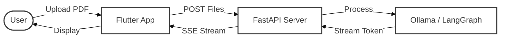

# DocVeil

**Intelligent PDF Analysis & Summarization**

DocVeil acts as a secure, intelligent layer between you and your documents. Drop in a PDF, and watch as it's analyzed page-by-page in real-time. We use advanced LLMs to distill complex information into clear, actionable summaries.

## Workflow



## Features

- **Real-Time Streaming**: See summaries generated instantly as the AI reads.
- **Secure Processing**: Temporal storage only; files are processed and then discarded.
- **Smart Context**: Understands document flow, not just isolated pages.
- **Cross-Platform**: Beautiful, responsive Flutter app for Desktop & Mobile.

## Quick Start

### 1. Backend (Python/FastAPI)

```bash
cd backend
python -m venv venv
source venv/bin/activate
pip install -r requirements.txt
python main.py
```

### 2. Frontend (Flutter)

```bash
cd frontend
flutter pub get
flutter run
```
