<div align="center">

# 🏗️ DocVeil Architecture: Parallel + Sequential Processing

**How two-stage workflow design creates comprehensive, context-aware summaries**

---

</div>

## 💡 The Core Innovation

DocVeil uses a **two-stage architecture** that combines the speed of parallel processing with the quality of sequential refinement—delivering both fast and comprehensive results.

### 🏗️ The Workflow

```mermaid
%%{init: {'theme': 'base', 'themeVariables': { 'primaryColor': '#667eea', 'primaryTextColor': '#fff', 'primaryBorderColor': '#764ba2', 'lineColor': '#667eea', 'secondaryColor': '#24243e', 'tertiaryColor': '#302b63', 'fontSize': '16px'}}}%%

graph TB
    subgraph Stage1["⚡ STAGE 1: Parallel Processing (Speed)"]
        PDF[📄 5-Page PDF] --> Load[Load All Pages]
        Load --> P1[Page 1 → LLM]
        Load --> P2[Page 2 → LLM]
        Load --> P3[Page 3 → LLM]
        Load --> P4[Page 4 → LLM]
        Load --> P5[Page 5 → LLM]

        P1 --> S1[Summary 1]
        P2 --> S2[Summary 2]
        P3 --> S3[Summary 3]
        P4 --> S4[Summary 4]
        P5 --> S5[Summary 5]
    end

    subgraph Stage2["🧠 STAGE 2: Sequential Refinement (Quality)"]
        S1 --> R1[Refined Summary 1]

        R1 --> Refine2["Refine with Context
        Previous: Summary 1
        Current: Summary 2"]
        S2 --> Refine2
        Refine2 --> R2[Refined Summary 2]

        R2 --> Refine3["Refine with Context
        Previous: Summary 2
        Current: Summary 3"]
        S3 --> Refine3
        Refine3 --> R3[Refined Summary 3]

        R3 --> Refine4["Refine with Context
        Previous: Summary 3
        Current: Summary 4"]
        S4 --> Refine4
        Refine4 --> R4[Refined Summary 4]

        R4 --> Refine5["Refine with Context
        Previous: Summary 4
        Current: Summary 5"]
        S5 --> Refine5
        Refine5 --> R5[Refined Summary 5]
    end

    R1 --> Final[📊 Complete Context-Aware Summary]
    R2 --> Final
    R3 --> Final
    R4 --> Final
    R5 --> Final

    style Stage1 fill:#302b63,stroke:#667eea,stroke-width:3px,color:#fff
    style Stage2 fill:#24243e,stroke:#764ba2,stroke-width:3px,color:#fff
    style Final fill:#667eea,stroke:#764ba2,stroke-width:4px,color:#fff
    style PDF fill:#764ba2,stroke:#667eea,stroke-width:2px,color:#fff
```



---

## 🎯 Why This Architecture?

### Stage Breakdown

| Stage                   | What It Does                               | Benefit                                         |
| ----------------------- | ------------------------------------------ | ----------------------------------------------- |
| **⚡ Parallel**   | All pages summarized simultaneously        | **5x faster** than sequential processing  |
| **🧠 Sequential** | Each summary refined with previous context | **Maintains narrative flow** across pages |
| **🔄 Stateful**   | LangGraph tracks state between refinements | **No information loss**                   |

### The Problem with Traditional Approaches

```
❌ Single-Pass:          Fast but shallow, no context
❌ Sequential-Only:      Deep but slow
✅ DocVeil (Hybrid):     Fast AND deep AND context-aware
```

---

## 🎓 Technical Deep Dive

### How Sequential Refinement Works

Each refinement pass receives:

**Input**:

```python
{
  "previous": "Summary of Page N-1",  # Context from previous page
  "current": "Summary of Page N"      # Current page to refine
}
```


---

## 🏆 Architecture Advantages

### 1. **LangGraph Stateful Workflow**

The workflow maintains **state** across the entire document:

- Previous summary → passed to next refinement
- Current summary → enhanced with prior context
- Cumulative understanding → builds page by page

### 2. **Structured Output**

DocVeil organizes by page:

- **Page 1**: Topic A (10 points)
- **Page 2**: Topic B (12 points)
- **Page 3**: Topic C (10 points)
- **Page 4**: Topic D (10 points)
- **Page 5**: Topic E (10 points)

Traditional AI tools dump everything into flat lists.

### 3. **Detail Density**

DocVeil summaries average **40-60 words per point**—complete sentences with full context.

Traditional summaries are **15-25 words**—more like bullet points.

### 4. **Privacy + Cost**

- Runs **locally** on Ollama (no API calls)
- **Zero cost** per summary
- **Complete privacy** (data never leaves your machine)
- **Encrypted processing** (AES-256-GCM)

---

## 📊 Performance Metrics

### Processing Speed

- **Parallel processing**: 5 pages in ~3 seconds (concurrent)
- **Sequential refinement**: 5 pages in ~7.5 seconds (1.5s each)
- **Total time**: ~10.5 seconds for comprehensive summary

### Real-World Example

**5-page technical document**:

- **Total points generated**: 52 detailed points
- **Average per point**: 48 words
- **Total summary**: ~2,500 words
- **Page separation**: ✅ Clear organization
- **Context flow**: ✅ Natural narrative

---


### Design Philosophy

1. **Parallel stage**: Extract information from all pages simultaneously (speed)
2. **Sequential stage**: Refine each summary with previous context (quality)
3. **Stateful tracking**: LangGraph maintains document understanding (coherence)

---

## 🎯 Best Use Cases

### ✅ Ideal for:

- **Research papers** (technical details preserved)
- **Long documents** (context across pages critical)
- **Learning materials** (comprehensive coverage needed)
- **Team documentation** (shareable, organized summaries)
- **Privacy-sensitive work** (local processing)

### Design Principles

- **Speed through parallelism** (Stage 1)
- **Quality through refinement** (Stage 2)
- **Coherence through state** (LangGraph)
- **Privacy through encryption** (AES-256)

---

## 🔬 Technical Stack

### Workflow Components

- **LangGraph**: Stateful workflow orchestration
- **LangChain**: Prompt management and LLM abstractions
- **Ollama**: Local LLM inference (llama3.1:8b)
- **FastAPI**: Async streaming API
- **Python asyncio**: Parallel page processing

