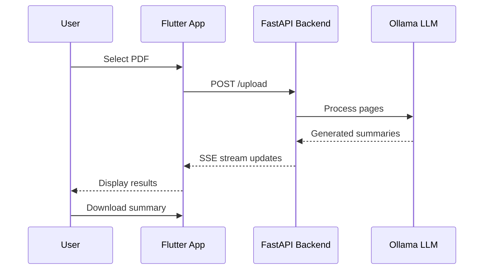

# DocVeil Frontend

Flutter app for PDF summarization with real-time streaming.

## What It Does

Upload PDFs, get detailed summaries powered by LangGraph + Ollama. Simple as that.

## Features

- PDF upload and processing
- Real-time streaming summaries (SSE)
- Clean, minimal UI
- Download summaries as text files

## Tech Stack

- Flutter + Dart
- SSE for real-time updates
- HTTP for API calls
- Material Design

## Project Structure

```
lib/
├── main.dart          # App entry point
├── screens/
│   ├── home_screen.dart       # Upload UI
│   └── summary_screen.dart    # Results display
├── services/
│   └── api_service.dart       # Backend communication
├── models/
│   └── summary.dart           # Data models
└── widgets/
    └── summary_card.dart      # Reusable components
```

## Workflow


## How the App Works

1. **Home Screen** - Pick a PDF file
2. **Upload** - Send to backend API
3. **Stream** - Watch real-time progress via Server-Sent Events
4. **Results** - Page-by-page summaries appear as they're generated
5. **Download** - Save complete summary as `.txt` file

## Backend Communication



## Running the App

**Prerequisites:**

- Flutter SDK installed
- Backend running on `http://localhost:8000`

**Run:**

```bash
cd frontend
flutter pub get
flutter run
```

**Platform:**

- macOS ✅
- iOS ✅
- Android ✅
- Web ✅

## API Endpoints Used

- `POST /upload` - Upload PDF, returns summary ID
- `GET /stream/{summary_id}` - SSE stream for real-time updates
- `GET /download/{summary_id}` - Download final summary

## Key Files

- **`api_service.dart`** - Handles all HTTP + SSE communication
- **`home_screen.dart`** - File picker and upload UI
- **`summary_screen.dart`** - Displays streaming results
- **`summary_card.dart`** - Individual page summary component

## Notes

- SSE keeps connection alive for real-time updates
- Backend must be running first
- Supports multi-page PDFs (tested with 100+ pages)
- Downloads save to platform's default download directory

That's it. Simple PDF summarization with a clean Flutter frontend.
